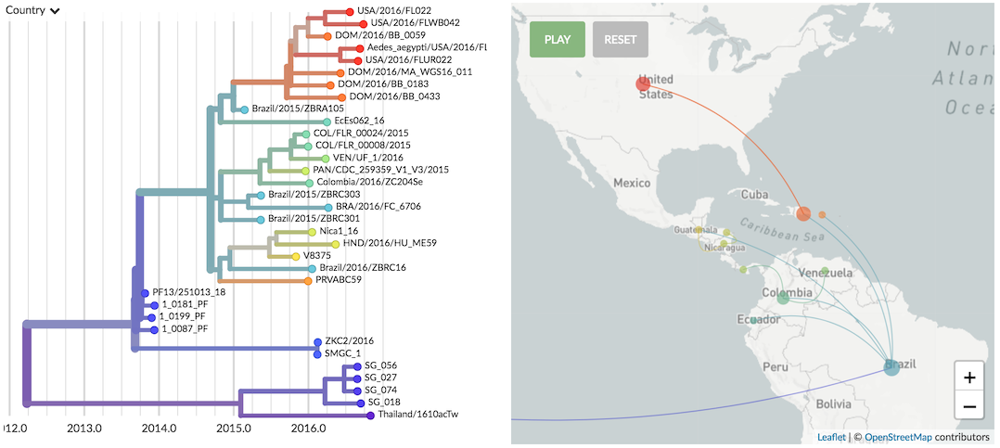

_[Please be sure you've installed augur and auspice.](/docs/getting-started/install)_

This guide walks you through the steps of running a phylogenetic analysis of the spread of Zika virus in the Americas. To begin, we'll navigate to `zika/` directory of `augur/` which contains Zika-specific build scripts.

```
cd nextstrain/augur/builds/zika
```

## Example data

This directory contains an example Zika FASTA at [`example_data/zika.fasta`](https://github.com/nextstrain/augur/blob/master/builds/zika/example_data/zika.fasta) that looks like

```
>PAN/CDC_259359_V1_V3/2015|zika|KX156774|2015-12-18|north_america|panama|panama|panama|genbank|genome|Shabman et al|https://www.ncbi.nlm.nih.gov/nuccore/KX156774|Direct Submission|Submitted (29-APR-2016) J. Craig Venter Institute, 9704 Medical Center Drive, Rockville, MD 20850, USA|https://www.ncbi.nlm.nih.gov/pubmed/
gaatttgaagcgaatgctaacaacagtatcaacaggttttattttggatttggaaacgagagtttctggtcatgaaa
>COL/FLR_00008/2015|zika|MF574562|2015-12-XX|south_america|colombia|colombia|colombia|genbank|genome|Pickett et al|https://www.ncbi.nlm.nih.gov/nuccore/MF574562|Direct Submission|Submitted (28-JUL-2017) J. Craig Venter Institute, 9704 Medical Center Drive, Rockville, MD 20850, USA|https://www.ncbi.nlm.nih.gov/pubmed/
tcagactgcgacagttcgagtttgaagcgaaagctagcaacagtatcaacaggttttattttggatttggaaacgag
>DOM/2016/BB_0059|zika|KY785425|2016-04-04|north_america|dominican_republic|dominican_republic|dominican_republic|genbank|genome|Metsky et al|https://www.ncbi.nlm.nih.gov/nuccore/KY785425|Zika virus evolution and spread in the Americas|Nature 546 (7658), 411-415 (2017)|https://www.ncbi.nlm.nih.gov/pubmed/28538734
tggctgccatgctgagaataatcaatgctaggaaggagaagaagagacgaggcgcagatactagtgtcggaattgtt
>BRA/2016/FC_6706|zika|KY785433|2016-04-08|south_america|brazil|brazil|brazil|genbank|genome|Metsky et al|https://www.ncbi.nlm.nih.gov/nuccore/KY785433|Zika virus evolution and spread in the Americas|Nature 546 (7658), 411-415 (2017)|https://www.ncbi.nlm.nih.gov/pubmed/28538734
agtttgaagcgaaagctagcaacagtatcaacaggttttatttyggatttggaaacgagagtttctggtcatgaaaa
```

This FASTA was originally downloaded from [ViPR](https://www.viprbrc.org/) and then metadata was cleaned and author information added via [fauna](https://github.com/nextstrain/fauna).

## Prepare

The first step of the pipeline is to run [prepare](/docs/bioinformatics-pipeline/prepare) on this FASTA. Prepare filters outliers, subsamples sequences based on space and time and specifies a reference. It also includes color and lat/long mappings. The Zika prepare script can be seen at [`zika.prepare.py`](https://github.com/nextstrain/augur/blob/master/builds/zika/zika.prepare.py).

Run the prepare script with

```
python zika.prepare.py --sequences example_data/zika.fasta
```

Running `zika.prepare.py` creates the file `prepared/zika.json`. We use a universal filestem to keep datasets organized, which in this case is `zika`.

The next step is to run [process](/docs/bioinformatics-pipeline/process) on the prepared JSON. Process aligns sequences to the reference, builds a phylogeny, dates internal nodes using a molecular clock model and infers geographic transitions across the tree. The Zika process script can be seen at [`zika.process.py`](https://github.com/nextstrain/augur/blob/master/builds/zika/zika.process.py).

## Process

Run the process script with

```
python zika.process.py
```

This creates intermediary files in `processed/` and auspice-ready JSONs in `auspice/`. These are `zika_tree.json` which contains an annotated phylogeny in JSON format and `zika_meta.json` which contains all relevant metadata.

Copy over auspice JSONs to the auspice directory with

```
cp auspice/zika_* ../../../auspice/data/
```

This assumes that `auspice/` and `augur/` are sister directories.

## Visualize

Navigate to the auspice directory and start the app in local mode by running

```
cd ../../../auspice
npm run start:local
```

Rather than finding data files online, local mode looks in `auspice/data/`. Open a browser and go to [http://localhost:4000/zika](http://localhost:4000/zika) to see the resulting visualization.



When using auspice locally like this, you need to directly provide the filestem as URL. There won't be datasets navigation as part of the app.
