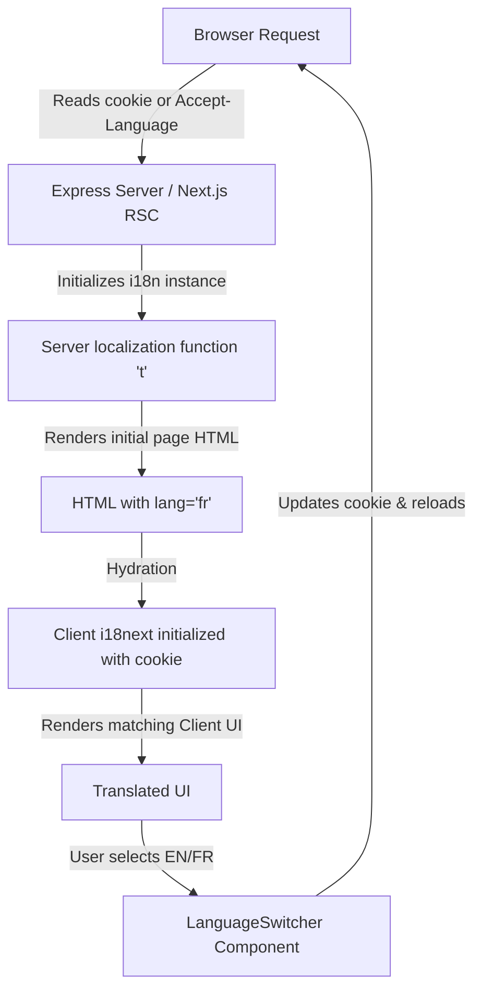

# Design Specification: State/Cookie-Based Internationalization System

This document outlines the high-level architecture and design of the internationalization (i18n) support added to `nextstrain.org`.

## Overview

Unlike standard Next.js App Router i18n configurations that use path-based routing (e.g. `/en/contact` or `/fr/contact`), nextstrain.org maintains clean, path-agnostic URLs (e.g. `/contact` regardless of language). 

Language selection is:
1. **Determined** on initial page load by checking standard browser locale negotiation headers (`Accept-Language`).
2. **Explicitly switched** by the user via a toggle button in the navigation bar.
3. **Persisted** via a cookie (`i18next-lng`).
4. **Respected** by both React Server Components (RSC) and Client Components.

---

## Architectural Components

### 1. Unified Configuration (`settings.ts`)
A single module defines the parameters for both server and client i18n instances.
- **Supported Locales:** `en`, `fr`
- **Default/Fallback Locale:** `en` (English)
- **Persistency Key:** `i18next-lng` cookie.

### 2. Request-Scoped Server Internationalization (`index.ts`)
Since Next.js Server Components run concurrently on a request-by-request basis, using a global singleton i18n instance would lead to cross-request state pollution (e.g. User A seeing User B's selected language).
- For every server request, a fresh, isolated `createInstance()` is initialized.
- The language is read dynamically using Next.js `cookies()` and `headers()`.
- Locales are loaded dynamically from the public directory.

### 3. Hydration-Safe Client Hook (`client.ts`)
Client components use the `useTranslation` hook from `react-i18next`.
- During hydration, the client reads the `i18next-lng` cookie to initialize `i18next` with the exact same language used by the server to render the HTML.
- This guarantees matching content and prevents Next.js hydration errors.

### 4. Language Persistency & Synchronization
- Clicking the language toggle in the nav bar writes the new language preference to the `i18next-lng` cookie.
- It triggers a page reload/refresh to ensure that any Server Components on the page are re-rendered and updated to the new language.

---

## Key Conventions

1. **Keys as English Values:** English dictionary entries must have identical key and value contents (e.g. `"contact": "contact"`). Capitalization and styling are handled in CSS/code (e.g., `text-transform: uppercase` or JS `.toUpperCase()`).
2. **Dynamic JSON Loading:** Localization files are stored in `public/locales/[lang]/[ns].json` and loaded dynamically via `i18next-resources-to-backend` so that clients only fetch the dictionaries they need.
