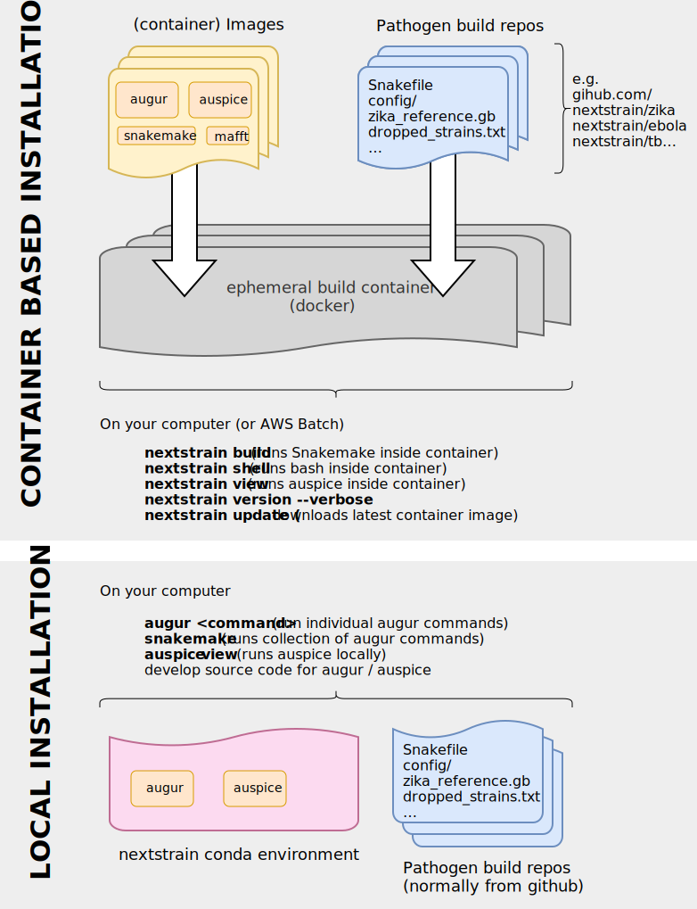

We -- and our collaborators -- have set up different versions of nextstrain all across the world, on many different computer architectures.
These experiences have resulted in two alternative approaches to installation, each with their pros & cons:

1. __"Local Install"__ which installs `augur` & `auspice` themselves, so that they're available as individual programs on the command line.
We highly recommend using conda to manage environments, however there are other options.
2. __"Container based installation"__ We provide a container-based system using docker, which includes all of the individual components behind nextstrain.
You may then interact with this container through the `nextstrain` CLI (command line interface).

No matter which method you use, you'll be able to run & modify pathogen builds on your own computer, and share the results through nextstrain.org if you wish to.

> It's important to remember which installation method you choose, as the instructions in the tutorials will be slightly different depending on your installation approach!

### Comparison between the two methods:

We've found that the container-based method is generally better if you want to grab one of the pathogen builds and run it with your data.
If you prefer to tinker with the methods or steps, or prefer your bioinformatics tools in a more Unix-y fashion, then a local installation may be the better choice.

---
## I'm running nextstrain, how to I remember which installation method I used?
* If you interact with things by running the `nextstrain` program, then you have the container based installation.
* If you enable nextstrain through `source activate nextstrain` or `conda activate nextstrain`, and then use `augur` or `auspice` then you have a local install.

