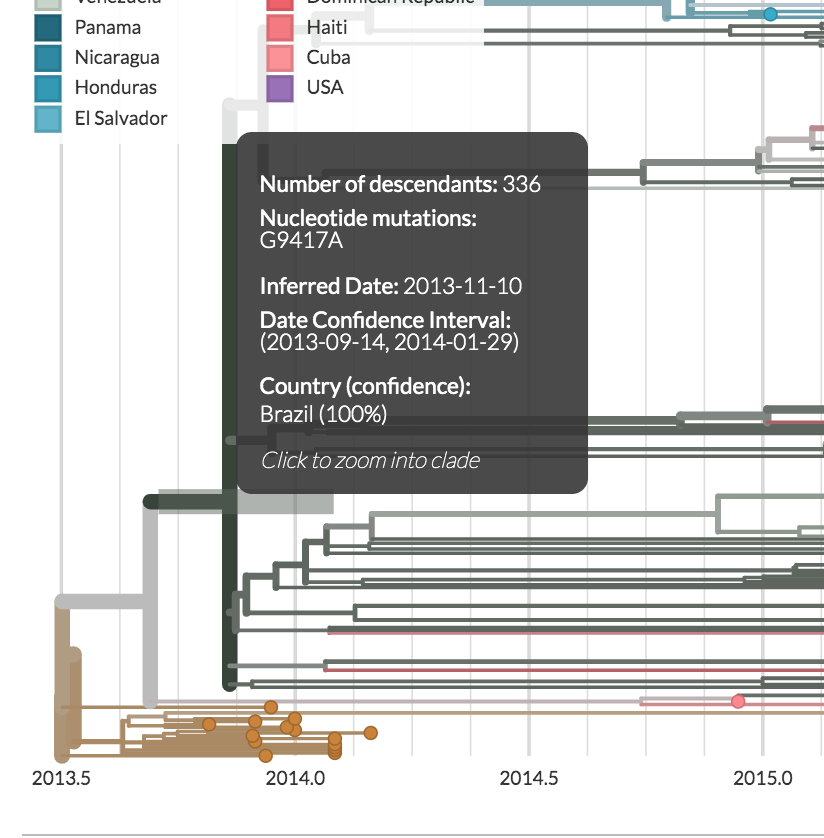
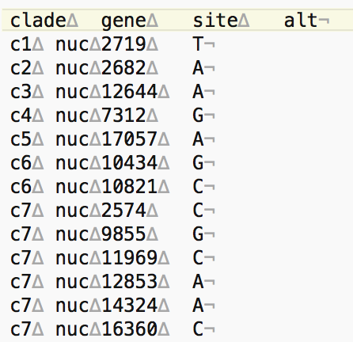

If you look at the [Nextstrain Seasonal Influenza tree](https://nextstrain.org/flu/seasonal/h3n2/ha/3y), you'll see that the clades are labelled (for example, `3c2`, `3c2.A`, `3c3` etc.). However labelled clades are not a default in Nextstrain builds. You may want to add clade labelling to your Nextstrain trees to more easily describe certain aspects of the tree, point out agreed-upon groups that are accepted by the field, or to facilitate zoomed views on the tree when using [Nextstrain narratives](https://nextstrain.org/docs/narratives/introduction). This bit of documentation describes how to add clade labeling to your Nextstrain build.

## Finding Clade Defining Nucleotide Mutations

You can find clade-defining mutations by exploring a Nextstrain tree that you have built previously. By default, Nextstrain trees will show amino acid mutations. While you can certainly define clades by amino acid changes, there may be many clades that you would like to label for which no amino acid mutations have occurred. Thus, it may work better to define clades using nucleotide mutations, which occur more frequently.


Then, head back to the tree. When you hover over a branch in the tree, a dark grey window pops up.
Inside this window, you'll see that there's a header that says `Nucleotide Mutations:`.
In the image below, the clade descended from this branch is defined by a mutation from G to A at site 9417 in the genome.
This is the information that you'll need for defining your clades.




## Make a TSV File Containing your Clade Mutations

The header of this TSV file should have the following entries: clade`\t`gene`\t`site`\t`alt

* `clade` is the name of your clade, whatever you want to refer to it as.

* `gene` should be entered as `nuc` if you are using nucleotide mutations. If you are using amino acid mutations, it would be the gene the amino acid mutation is in, as that gene is defined within the build.

* `site` is the position in the genome where the mutation occurred.

* `alt` is the nucleotide that the site mutated to. For example if the nucleotide mutation is `G9417A`, then `alt` would be `A`.

Note that some clades will be defined by more than one mutation. To avoid any conflicts with other clades, you should list all the mutations in the TSV file (using the same clade name, but different site information). A picture of what this tsv file should look like, showing invisible characters, is given below. Note that clades `c1`, `c2`, `c3`, `c4`, and `c5` are defined by only one mutation, but that `c6` is defined by two mutations, and thus has two entries, one for each mutation. Along the same lines, there are six mutations defining clade `c7`, and thus there are six entries in the `tsv` file.



> The `∆` and `¬` characters are displayed by the [Atom text editor](https://atom.io/) to represent "tab" and "(unix) end of line" characters, respectively.

It doesn't really matter where you save your `clades.tsv` file (as long as you know the path to the file), we usually save this file within the `config` directory of our workflows, as this is where other files such as `colors.tsv` are usually kept within nextstrain analysis directories.

> _Side note_: Please avoid numerical labelling for the clades, which currently cause issues.
I.e. instead of using `1`, `2`, `3` etc, add a letter ahead of the number - for instance `c1`, `c2`, `c3`.

## Changing your Workflow to Add Clade Labeling by Editing your Snakefile

Clade labelling is not a default task in the standard Nextstrain workflow. However, you can certainly add it to your workflow! To do so, you'll need to edit your Snakefile.

The first thing you'll need to edit is `rule files:`. Here, you'll need to add an entry to the `params` section that references your file. For example, you could add `clades = config/clades.tsv` to the `params` section. The important thing here is that the path to your TSV file is correct. This is what this looks like for us in one of our Snakefiles:

```
rule files:
    params:
        input_fasta = "data/sequences.fasta",
        metadata = "data/metadata.tsv",
        dropped_strains = "config/dropped_strains.txt",
        reference = "config/reference.gb",
        colors = "config/colors.tsv",
        lat_longs = "config/lat_longs.tsv",
        auspice_config = "config/auspice_config.json",
        root_name = "lab-outgroup",
        clades = "config/clades.tsv"
```

Next, you'll need to add a rule to the Snakefile that tells the workflow to perform the clade labelling. We usually place this rule after the `translate` rule.

Here's an example rule that we wrote for clade labeling.

```
rule clades:
    message: " Labeling clades as specified in config/clades.tsv"
    input:
        tree = rules.prune_outgroup.output.tree,
        aa_muts = rules.translate.output.node_data,
        nuc_muts = rules.ancestral.output.node_data,
        clades = files.clades
    output:
        clade_data = "results/clades.json"
    shell:
        """
        augur clades --tree {input.tree} \
            --mutations {input.nuc_muts} {input.aa_muts} \
            --clades {input.clades} \
            --output {output.clade_data}
        """
```

Finally, you'll need to edit the `export` rule to make sure that the clade labelling information gets added to the Auspice JSONs. You'll need to add the clade data as an input to `export`, and you'll also need to include it as an argument in the `--node-data` flag of the `auspice export command`.

For instance, this is what our `export` command looks like:

```
rule export:
    message: "Exporting data files for auspice"
    input:
        tree = rules.prune_outgroup.output.tree,
        metadata = rules.combine_strain_epi_names.output.metadata,
        branch_lengths = rules.refine.output.node_data,
        traits = rules.traits.output.node_data,
        nt_muts = rules.ancestral.output.node_data,
        aa_muts = rules.translate.output.node_data,
        colors = files.colors,
        lat_longs = files.lat_longs,
        clades = rules.clades.output.clade_data,
        auspice_config = files.auspice_config
    output:
        auspice_tree = rules.all.input.auspice_tree,
        auspice_meta = rules.all.input.auspice_meta
    shell:
        """
        augur export \
            --tree {input.tree} \
            --metadata {input.metadata} \
            --node-data {input.branch_lengths} {input.traits} {input.nt_muts} {input.clades} {input.aa_muts} \
            --colors {input.colors} \
            --lat-longs {input.lat_longs} \
            --auspice-config {input.auspice_config} \
            --output-tree {output.auspice_tree} \
            --output-meta {output.auspice_meta}
        """
```

Note that in the input we have `clades = rules.clades.output.clade_data` and in the `--node-data` flag, we have an argument `{input.clades}`.

**Important**: You may have to edit the names depending on how you named your rules, your inputs, and your outputs. For example, in the `export` rule above, we have a line that says `clades = rules.clades.output.clade_data`. This is formatted this way because we have a rule called `clades` and the output from that rule is called `clade_data`. However if our rule had been called something different, say `label_clades_on_my_tree`, then the referenced file would have to be labelled `rules.label_clades_on_my_tree.output.clade_data`. This is also true for however you name the output files.
