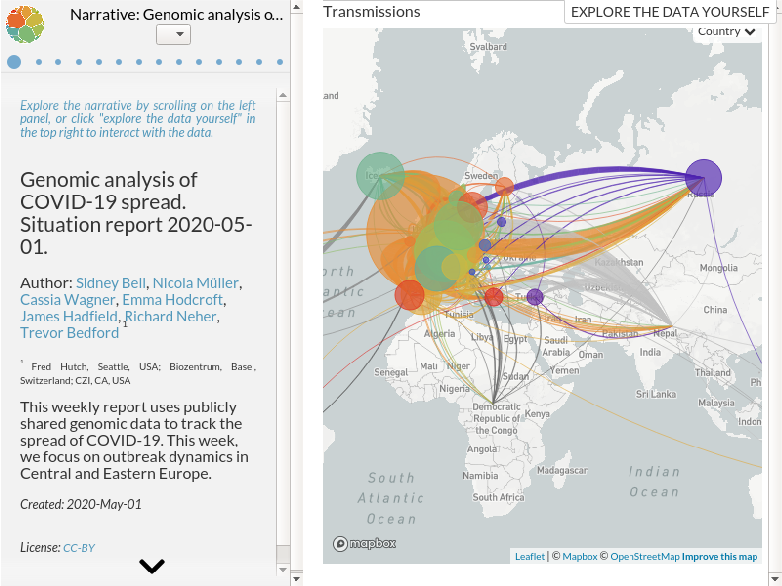

## What are Nextstrain narratives?
Narratives are a method of data-driven storytelling.
They allow scientists (or anyone!) to author content which is displayed alongside the "normal" view of the data.
This content drives the way in which data is displayed, so instead of the user changing how things are displayed, the view automatically changes as you move between paragraphs in the narrative.
This allows you to communicate results with the appropriate views into the data, whilst maintaining the ability for the user to jump back to the "normal" viewing mode and interact with the data.

## Writing narratives
For more information on how to write your own narratives and share them, check out the [Auspice documentation on narratives](https://nextstrain.github.io/auspice/narratives/introduction).

## Examples
Here is one example of a narrative, which illustrates the spread of COVID-19:

