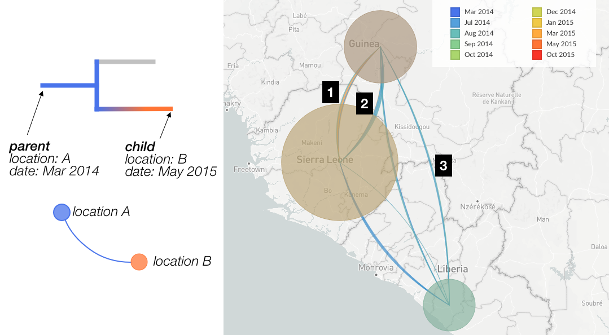

The map is a centerpiece of Nextstrain's visualisation, able to convey complex information to a wide audience.
This how-to is intended to provide an overview of what's being displayed, and hopefully dispel some potential misinterpretations.

_Figure 1. [Nextstrain map](https://nextstrain.org/zika?d=map) of Zika virus movement between countries. Numerical labels are referred to in the text._

Before we begin, it's important to keep in mind that all the data displayed on the map is drawn directly from the phylogenetic tree.
In practice, every dataset is subject to some form of sampling bias, and therefore the map will be as well.
If there are no samples (genomes) from a certain location in the dataset being visualised, then we will have no data to display on our map!

As you **interact with Nextstrain** -- whether you zoom into the tree, filter the data, change the color-by or geographic resolution -- then every panel, including the map, will update to represent just the data selected under the current view settings.

## Demes (Circles)

Perhaps the most fundamental aspect of Nextstrain's map, the circles (demes) associate samples (tips on the tree) with locations on the map.
The demes use different visual techniques to convey different pieces of information:

_Figure 2. Examples of demes.
B,C and D are representations of samples from the USA in [the Zika dataset](https://nextstrain.org/zika) with different choices of color-by._

The **size (area) of the circle** is used to convey the number of samples associated with the current location.
This should only be interpreted relative to other circles currently displayed on the map, and may change as you zoom into the map or subsample the data.
For instance, in Fig 2A, the larger circle represents a deme with four times as many samples as the smaller one.
As you filter the dataset, change the displayed time range, or zoom into the tree, the relative sizes of the circles will change according to what locations the in-view samples represent.

Note that ancestral (inferred) nodes on the tree are _not_ represented by circles on the map!

A circle's **color** conveys the metadata currently selected as the overall coloring of the dataset.
The way we convey this changes according to the type of color-scale employed.
For instance, in Fig 2B the circle comprises samples from the USA and is therefore colored red (this is actually the circle from Figure 1, label "1"). 
In Fig 2C we have a discrete color scale representing authorship, and we convey this information by a pie chart with areas of each slice representing the proportion of samples in this location from each author.
In Fig 2D we have a continuous color scale (sampling date) and convey this by a blending of colors -- the samples which make up this deme actually span Jun 2016 and Oct 2016.
You can see the legend representing currently selected metadata in either the top-left of the phylogenetic tree or the top-right of the map (see "3" in Figure 1).

The **location** of circles represents the geographic resolution currently selected.
Looking at Figure 1, label "5", we have a geo-resolution of "country" and so this circle represents an individual country.
In the [zika dataset](https://nextstrain.org/zika) you can change this to "Region" and you'll see the map update accordingly.
Each dataset is responsible for associating different locations with a GPS co-ordinate which we use as the center of the circle -- bear this in mind when you are reading the map and don't over-interpret the precision.
For example, the circle representing the USA (labelled "1" in Figure 1) represents the entire country, not a specific location in Kansas!

## Transmissions (Lines)

These lines typically represent our best estimate of the movement of the pathogen over the selected time slice.
For instance, Figure 3 indicates movement of Ebola virus between countries during the West African Ebola outbreak. 
Each individual line represents a parent-child branch in the phylogenetic tree where the value of the current geographic resolution differs.
This means that if values for the geographic resolution haven't been inferred for internal nodes of the tree then no transmission lines can be drawn.
There is a toggle to switch the transmission lines off in the sidebar (Figure 1, label "5").

_Figure 3.
Left: Cartoon of how the tree determines the construction of transmission lines.
Right: Example of transmission lines showing [between country movement of Ebola](https://nextstrain.org/ebola)._

**Line thickness.**
Each rendered arc is actually a collection of individual lines of identical thickness; in Fugure 3, each line identified by a branch in the tree indicates a change in the value of the current geographic resolution.
Lines which look "thicker" therefore represent more observed cases of movement between the two locations (circles) - in other words, there are a larger number of situations in the tree where the parent node is ascribed one location and the child node the other. 
For instance, in Figure 3 the arc labelled by "1" is thicker than the arc labelled "3", indicating that in the [Ebola dataset](https://nextstrain.org/ebola) there are more observed cases of movement between Guinea and Sierra Leone than there are between Liberia and Guinea.

Note that the thickness of lines is directly correlated with the number of observed movements between locations in the tree, and does not consider the number of onward cases (samples) which may result from a given transmission event. 

**Directionality** is conveyed by the [orientation of the arc](https://en.wikipedia.org/wiki/Curve_orientation).
When travelling from source to origin location, the inside of the curve is on the left-hand-side (a positively orientated curve). 
If we examine the transmission lines between Guinea & Sierra Leone (Figure 3, labels 1 and 2) we can see that the inside of line 1 is on the left-hand-side when travelling from Guinea to Sierra Leone, and thus represents movement of the virus in that direction.
Line 2 is the opposite, and represents viral movements from Sierra Leone to Guinea.

**Line color** 
The color of transmission lines represents the currently selected "color-by" -- the metadata displayed in the legend -- of each transmission.
If we examine the cartoon example in Figure 3, we see that the parent and child nodes have a different location, which we will use to draw a line on the map from location A to location B.
The color-by in this example is "date", so the line will be colored blue, which corresponds to the date value at the origin of the transmission.
As transmission arcs potentially consist of a number of lines, we can have multiple different colors within a transmission arc between locations. 
Looking at the transmission from Guinea to Sierra Leone (Figure 3, label "1"), we can see that there are some transmissions from earlier in the outbreak (blue colors) as well as a number of transmissions from later on (orange colors).

If the selected color-by is not present at the origin of an individual transmission, then the line will be colored grey.
It's important to realise that the line color is not related to the geographic resolution, which determines the presence and layout of the lines.

**Uncertainty** is always inherent in the reconstructions from which the transmission data is drawn.
Often this uncertainty is encoded in the dataset, and we use this to reduce the saturation of branch colors in the phylogenetic tree.
Currently we don't convey this uncertainty in the map -- we simply use whatever values the dataset defines for the geographic resolution in question.
Thus, it's a good idea, when reading the map, to check the phylogeny to get an idea of the uncertainty in a transmission line.

## Animation

If we click the "Play" button (Figure 1, label "4") we can watch the outbreak unfold before our eyes. 
This works by dividing the temporal window in the given dataset into a number of slices and moving between them.
You can choose the settings for the animation via the controls in the sidebar (Figure 1, label "5").
Note that for animation to be available the tree must have temporal data inferred for ancestral nodes.
