## A/H3N2

**We expect clade 3c2.a viruses to continue to predominate over 3c3.a and 3c3.b viruses. Diversity within 3c2.a is beginning to accrue with the emergence of several clades of appreciable frequency, the most notable of which is the new 171K clade that has very recently risen to high frequency.**

We base our primary analysis on a set of viruses collected between Feb 2014 and Jan 2016, comprising approximately 100 viruses per month where available and seeking to equilibrate sample counts geographically where possible. This equilibration attempts to collect equal samples from Africa, China, Europe, Japan/South Korea, North America, Oceania, South America, South Asia, Southeast Asia and West Asia. In the following analysis we collapse samples from China, Southeast Asia, Japan and Korea into a single region that we're calling "East Asia", resulting in East Asia possessing greater sample counts than North America or Europe. The only month that significantly departs from equitable sampling is Jan 2016 with 61 viruses, primarily from Europe and North America. Oct 2015 to Jan 2016 are lacking Southern Hemisphere viruses. We subsample to 100 viruses per month and not more to keep sample counts as equitable as possible across space and time.

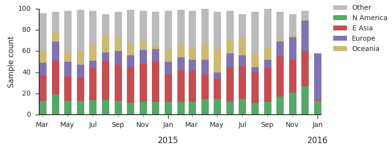

For each virus, we know its date of collection and we know its genetic make up, allowing us count the number of viruses belonging to a particular genetic lineage through time. We use these timeseries of presence/absence to estimate clade frequencies through time. This estimation smooths month-to-month sampling variation.

Throughout 2015, clade 3c2.a viruses predominated over 3c3.a and 3c3.b viruses. The only exception to this trend has been the recent reemergence of 3c3.a viruses in Europe. However, this clade of European 3c3.a viruses lacks recent amino acid substitutions relative to the 3c3.a parent. Thus it appears that the reemergence of 3c3.a viruses in Europe is due to epidemiological factors, rather than genetic factors. In addition, we find that 3c2.a viruses still predominate in Europe over 3c3.a viruses despite their recent uptick and 3c3.a isolates have been declining in recent weeks.

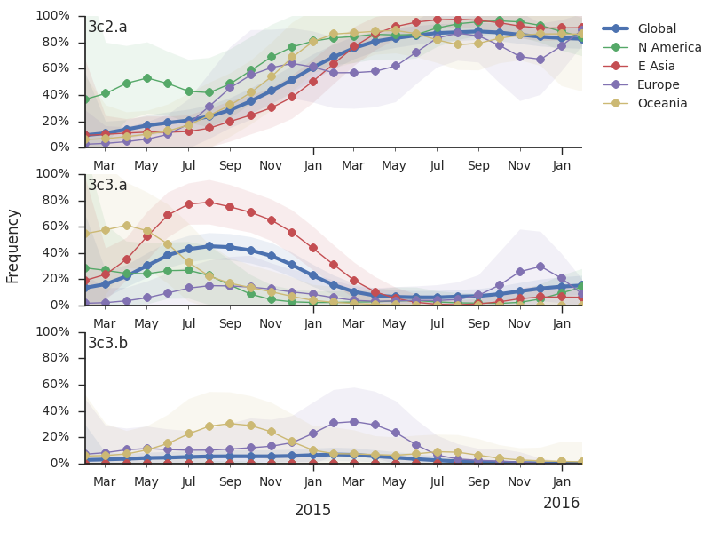

Within clade 3c2.a, there have emerged multiple circulating amino acid variants including HA1:114T, HA1:142K/197R and (HA1:171K, HA2:77V/155E). This last clade corresponds to HA1:171K/406V/484E. The substitution 171K has emerged twice within 3c3.a. The earlier substitution did not spread far. However, the recent 171K substitution has occurred alongside HA2:77V/155E and is present in more recent viral isolates. Within clade 142K/197R there is a subclade of significant size bearing 168V.

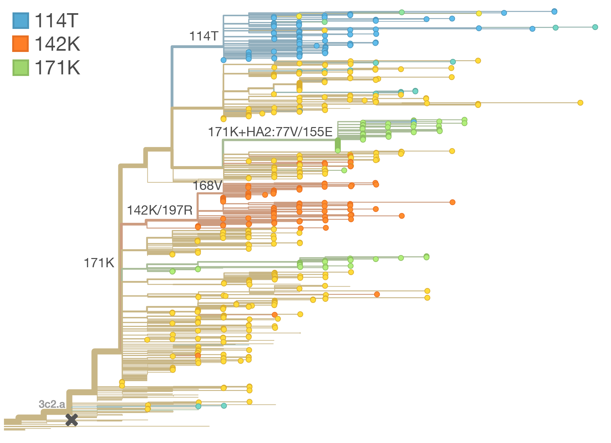

The 114T variant peaked in frequency around July 2015 and similarly the 142K variant has been around for more than a year with a low but even geographic distribution, although has seen a recent uptick in frequency since October due to 168V. We expect neither of these variants to be under strong positive selection. The T160K substitution is observed scattered within clade 3c2.a and overrepresented in sequences obtained from cultured virus.

We observe a recent rapid increase in frequency of (HA1:171K, HA2:77V/155E) especially in Asia and North America. This has been the fastest growing variant within 3c2.a that we have observed. This clade also shows [rapid phylogenetic branching](http://elifesciences.org/content/3/e03568v1/abstract), corroborating its rapid rise. Additionally, the subclade bearing HA1:142K/197R/168V has recently risen in frequency, although not as rapidly as the (HA1:171K, HA2:77V/155E) clade. We estimate clade HA1:142K/197R/168V has gone from 1% global frequency in March 2015 to 19% global frequency today, while clade (HA1:171K, HA2:77V/155E) has gone from 1% global frequency in June 2015 to 29% global frequency today. For comparison, 3c3.a viruses increased in frequency from 1% to 31% in a similar span of 8 months time.

_Barring substantial changes in other clades, we predict the (HA1:171K, HA2:77V/155E) variant to dominate._

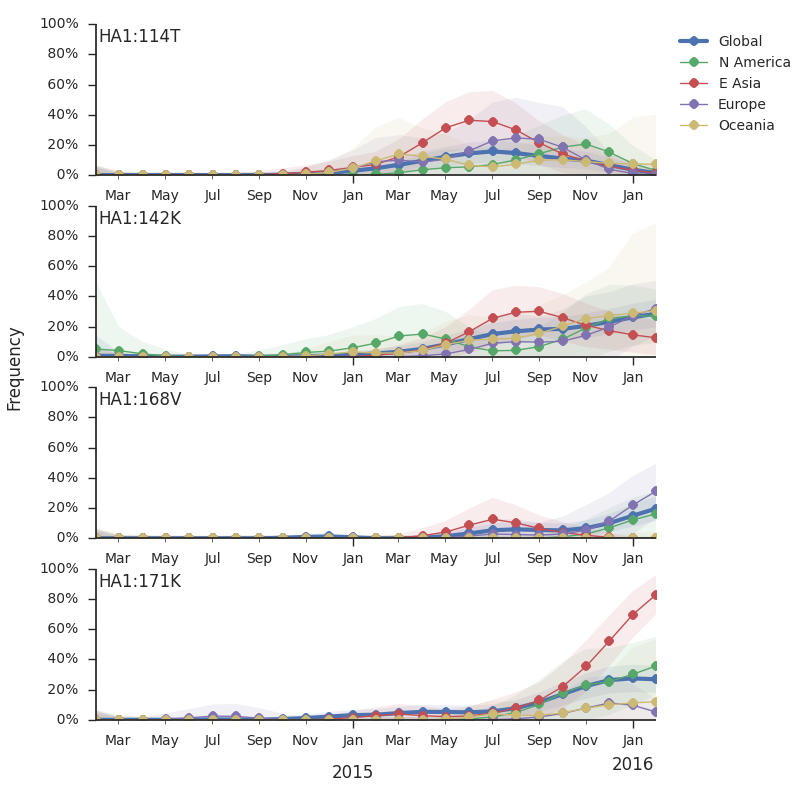

Due to poorly performing HI assays on 3c2.a samples and the lack of recent data, antigenic diversity within 3c2.a is hard to assess. The data available to us do not suggest significant antigenic evolution. Here we show recent antigenic data (through September 2015) using sera against A/HongKong/5738/2014 from the Crick Worldwide Influenza Centre alongside model fits. Cooler color indicate greater antigenic similarity. Note that we lack HI data for (HA1:171K, HA2:77V/155E) viruses. Epitope mutation count would predict that HA1:142K/197R/168V is more drifted than (HA1:171K, HA2:77V/155E) with 2 epitope mutations vs 1 epitope mutation, although this requires confirmation through HI or other antigenic characterization.

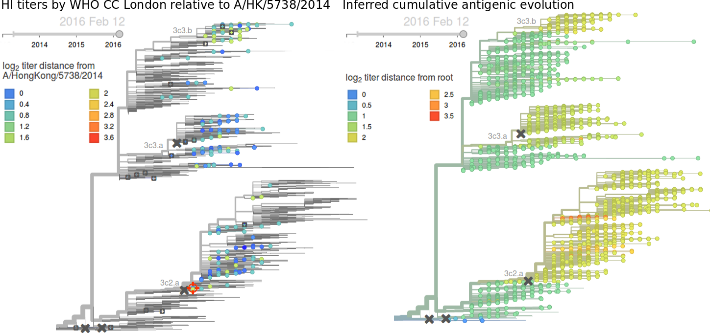

We would prioritize further characterization of viruses basal to the (HA1:171K, HA2:77V/155E) and HA1:142K/197R/168V clades. These include A/Washington/51/2015 and A/Laos/928/2015 for 171K and A/Bangladesh/3400/2015 and A/Roma/29/2015 for 168V.

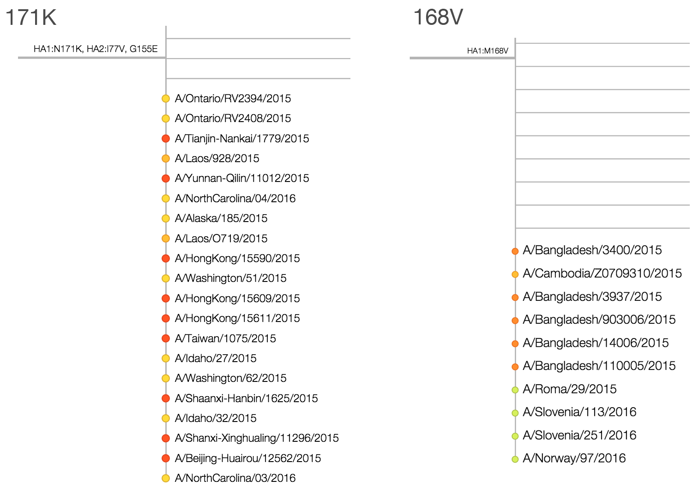

## A/H1N1pdm

**Within clade 6b, the clade 6b.1, comprising 84N/162N/216T, has rapidly risen to predominate the H1N1pdm population in the latter half of 2015. Although there is no obvious serological evidence for antigenic novelty of 6b.1, its extremely rapid rise in frequency suggests a selective mechanism promoting its spread.**

We base our primary analysis on a set viruses collected between Feb 2014 and Feb 2016, comprising approximately 100 viruses per month where available and seeking to equilibriate sample counts geographically where possible. As discussed above, this equilibration attempts to collect equal samples from Africa, China, Europe, Japan/South Korea, North America, Oceania, South America, South Asia, Southeast Asia and West Asia. In the following analysis we collapse samples from China, Southeast Asia, Japan and Korea into a single region that we're calling "East Asia", resulting in East Asia possessing greater sample counts than North America or Europe. Recent months through Jan 2016 have largely sufficient sample counts and sample distributions, although are lacking Southern Hemisphere viruses. We subsample to 100 viruses per month and not more to keep sample counts as equitable as possible across space and time.

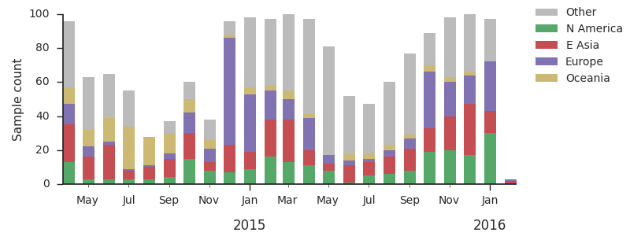

Within clade 6b, genetic variants have begun to emerge, most notably HA1:84N/162N/216T, referred to here as clade 6b.1, and (HA1:152T, HA2:174E), referred to here as clade 6b.2. The 6b.2 clade corresponds to HA1:152T/501E.

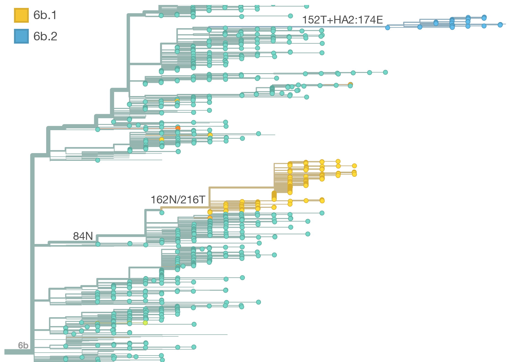

With the exception of China, all regions of the world are now dominated by 6b.1. The 84N substitution rose in frequency around April 2015 and 162N followed around October 2015. Additionally, China and Oceania have seen a recent rise in 6b.2 viruses. Recent samples from China have been mixed between 6b.1 and 6b.2 viruses. We note that that are very few Oceania viruses on which to base estimates resulting in wide confidence intervals.

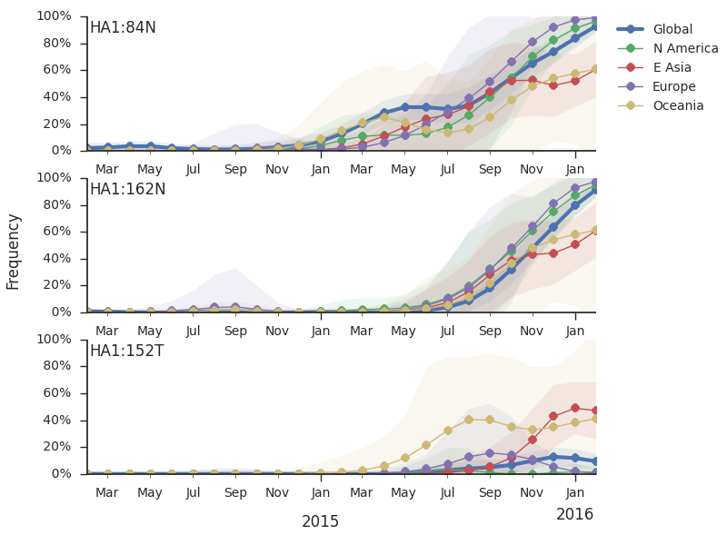

Although recent samples from China have contained a large fraction of 6b.2 viruses, samples have been limited in geographic scope with the majority of Chinese 6b.2 isolates originating in Shanghai. Further sampling of a more diverse geographic area may revise our estimates of the frequency of 6b.2 in Asia downwards.

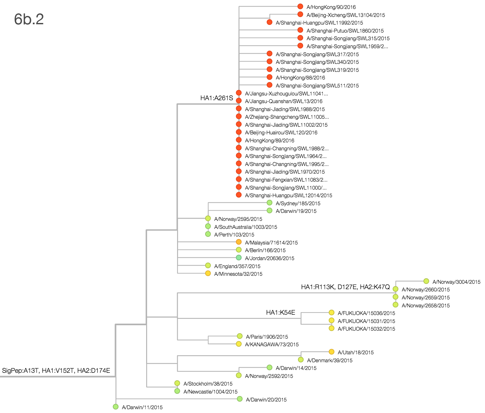

The 6b.1 clade comprising 84N/162N/216T rose from very low counts in early summer 2015 to almost 100% by early 2016 in Europe and North America. The global rise of 6b.1 is extremely rapid relative to average H1N1pdm dynamics. This clade is also singled out by the local branching index as the clade most likely to persist. The rapid rise of 6b.1 viruses is likely selective in origin. Along these lines, we observe a very slight drop in titer associated with the 84N substitution of approximately 0.5 log2 HI dilutions. We lack antigenic data to catalog an effect from the 162N, 216T or 152T substitutions. Here we show recent antigenic data (through September 2015) from the Crick Worldwide Influenza Centre alongside model fits.

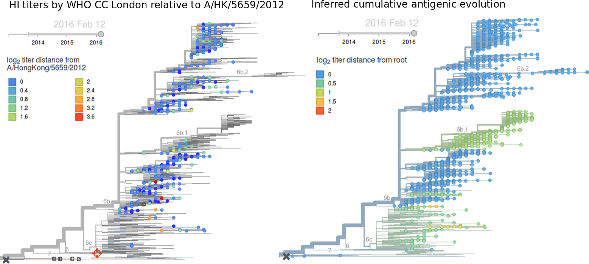

Generally, we would not expect such a minor antigenic effect to have a major selective advantage. It was previously suggested that the cause of the 2013-2014 H1N1pdm season was due to antigenic changes via K163Q despite a lack of an effect on naive ferret antisera (<a href="http://www.pnas.org/content/111/44/15798">Linderman et al</a>). The spread of 163Q corresponds to the previous increase in frequency of 6b viruses. Here, we observe a significantly faster take off of 6b.1 viruses than observed for 6b, with 6b.1 viruses reaching high frequency in ~6 months time rather than the ~12 months required for clade 6b.

## B/Vic

**Within clade 1A viruses, there are few examples of selectively interesting clades. The clade 129D/146I/117V has risen to high frequency, but at a rate that suggests little effect from natural selection.**

North American and European isolates almost all contain 129D. While the majority of North American isolates also contain 117V, recent European isolates more ancestral with 117I instead of 117V. Recent isolates from the Southern hemisphere (and some Hong Kong isolates) are from the highly derived clade 124A/56K.

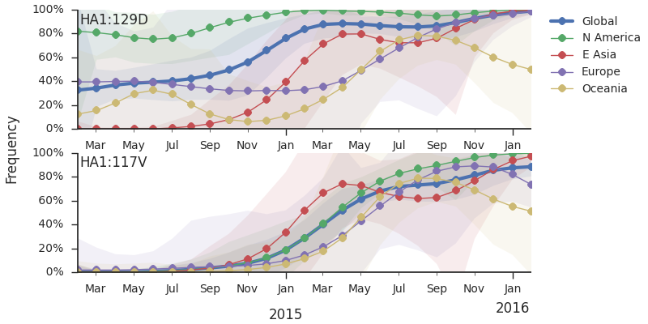

No prominent amino acid substitutions are observed within the 117V clade, but this clade has been growing most strongly and is picked by the local branching index as the putatively most successful clade.

## B/Yam

**Clade 3 has predominated the B/Yamagata population with the recent emergence and spread of the substitution HA1:172Q. At this point clade 2 viruses are close to extinct.**

In 2015, the vast majority of B/Yamagata isolates were of clade 3 viruses. Clade 2 appears to be barely hanging on and we expect it to continue to persist only if it acquires additional selective substitutions.

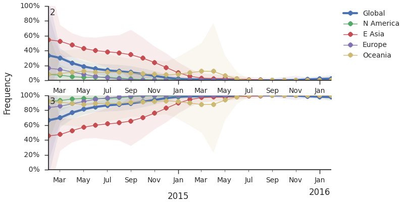

Within clade 3, HA1:172Q has predominated during the whole of 2015, while the subclade HA1:172Q/251V has been slowly rising to frequencies close to 100% in all geographic regions. The HI model assigns a modest titer drop of about 0.3 units to the M251V branch. Within the clade 251V there are multiple subclades of intermediate size, one of which predominates in China. None of these exhibit particularly striking dynamics.

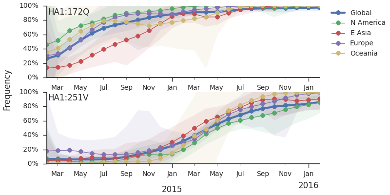
.
---

Written by [Trevor Bedford](bedfor.io) and [Richard Neher](https://neherlab.wordpress.com/). This work is made possible by the [GISAID Initiative](http://gisaid.org/) and the open sharing of genetic data by influenza research groups from all over the world. [We gratefully acknowledge their contributions.](http://nextflu.org/acknowledgements/) Give us a shout at [@trvrb](https://twitter.com/trvrb) or [@richardneher](https://twitter.com/richardneher) with questions or comments.

Please cite: [Neher RA, Bedford T. 2015. nextflu: real-time tracking of seasonal influenza virus evolution in humans. Bioinformatics 10.1093/bioinformatics/btv381](http://dx.doi.org/10.1093/bioinformatics/btv381).

---
